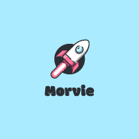

---

<!-- PROJECT LOGO -->
 

  

  <h3 align="center">Forums REST API</h3>

  

     
    <a href=""><strong>Explore the docs »</strong></a>
     
     
    <a href="">View Demo</a>
    ·
    <a href="https://github.com/Morvie/Forums.API/issues">Report Bug</a>
    
  

---

# Description

Forums API is a microservice of the Morvie product. This project was made during the third year of my education at Fontys Hogeschool ICT. In which I have to fullfill learning outcomes, within the bulletpoints below I will explain a few topics:

- CI-pipeline with docker push.
- Dockerized API and Microsoft SQL server.
- Security with dependabot.
- Local deployment with Kubernetes and services.

 

---

# :syringe: Current Health checks

 
<table align="center" class="no-border" >
  <tr>
    <td></td>
  </tr>
</table>
 

---

### :hammer_and_wrench: Languages and Tools :

This section should list any major frameworks/libraries used to bootstrap your project. Leave any add-ons/plugins for the acknowledgements section. Here are a few examples.

  &nbsp;
  &nbsp;
  &nbsp;
  &nbsp;
  &nbsp;
  

 

---

### Maintainers SEP 2022 - JAN 2023

---

<table align=center>
  <tbody>
    <tr>
     <td align="center"><a> <b>Mark Goertz</b></a></td>
  </tbody>
</table>

---

This project is an assignment of:
Fontys: University of Applied Science

(<a href="#readme-top">back to top</a>)

